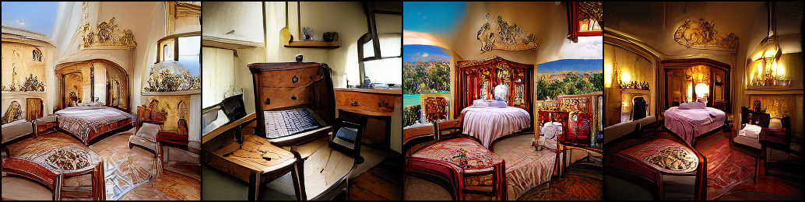

Feed forward VQGAN-CLIP model, where the goal is to eliminate the need for optimizing the latent
space of VQGAN for each input prompt. This  is done by training a model that takes as input
a text prompt, and returns as an output the VQGAN latent space, which is then
transformed into an RGB image. The model is trained on a dataset of text prompts
and can be used on unseen text prompts.
The loss function is minimizing the distance between the CLIP generated image 
features and the CLIP input text features. Additionally, a diversity loss can be used to make increase 
the diversity of the generated images given the same prompt.

[![Open In Colab][colab-badge]][colab-notebook]

[colab-notebook]: <https://colab.research.google.com/drive/1N8vvdhkvLaMefTIW_WYuJa-FflqyBnHr?usp=sharing>
[colab-badge]: <https://colab.research.google.com/assets/colab-badge.svg>

[Run it on Replicate](https://replicate.ai/mehdidc/feed_forward_vqgan_clip)

# News

- **09 July 2022**
    - [Version 0.4](https://github.com/mehdidc/feed_forward_vqgan_clip#pre-trained-models) released. New models that can be tried in the [notebook](https://colab.research.google.com/drive/1N8vvdhkvLaMefTIW_WYuJa-FflqyBnHr?usp=sharing) and on [Replicate](https://replicate.ai/mehdidc/feed_forward_vqgan_clip):
        - Three models (one for 256x256 resolution, one for 512x512 resolution) trained with [OpenCLIP](https://github.com/mlfoundations/open_clip) Vit-B/32 ([LAION-2B-en](https://laion.ai/blog/laion-5b/) model)
        - One model for ViT-B/32 trained with CLIP and pixel reconstruction
    - Update [Colab Notebook](https://colab.research.google.com/drive/1N8vvdhkvLaMefTIW_WYuJa-FflqyBnHr?usp=sharing) with easy to use widgets for image and video generation
    - Support [CLOOB](https://github.com/crowsonkb/cloob-training) models trained by [@crowsonkb](https://github.com/crowsonkb) on [LAION-400M](https://laion.ai/blog/laion-400-open-dataset/)
    - Support Training/using **priors** to generate image embeddings from text embeddigs using [Net2Net](https://github.com/CompVis/net2net), this can be used to generate multiple images for the same text prompt. See [here](#generate-images) for an example. Also available in the [Colab Notebook](https://colab.research.google.com/drive/1N8vvdhkvLaMefTIW_WYuJa-FflqyBnHr?usp=sharing) and [Replicate](https://replicate.ai/mehdidc/feed_forward_vqgan_clip).
    - Support L2 loss and Total variation losses as regularizations
    - Support [OpenCLIP](https://github.com/mlfoundations/open_clip) models
    - Support evaluation in the training phase
    
- **04 January 2022**
    - Support [CLOOB](https://github.com/ml-jku/cloob) as an alternative OpenAI's CLIP models
    - Support [X-transformer](https://github.com/lucidrains/x-transformers) as an alternative to MLP Mixer and VitGAN
    - New models (can be tried in the [notebook](https://colab.research.google.com/drive/1N8vvdhkvLaMefTIW_WYuJa-FflqyBnHr?usp=sharing) and on [Replicate](https://replicate.ai/mehdidc/feed_forward_vqgan_clip)) ) released (see 0.3 version in https://github.com/mehdidc/feed_forward_vqgan_clip#pre-trained-models):
        - New [model](https://github.com/mehdidc/feed_forward_vqgan_clip/releases/download/0.3/cc12m_32x1024_mlp_mixer_clip_ViTB32_256x256_v0.3.th) which use text and real image embeddings as a loss instead of just text embeddings, trained on conceptual captions 12M
        - New [model](https://github.com/mehdidc/feed_forward_vqgan_clip/releases/download/0.3/cc12m_32x1024_mlp_mixer_cloob_rn50_256x256_v0.3.th) based on [CLOOB](https://github.com/ml-jku/cloob)
        - First 512x512 [model](https://github.com/mehdidc/feed_forward_vqgan_clip/releases/download/0.3/cc12m_256x16_xtransformer_clip_ViTB32_512x512_v0.3.th) based on [X-transformer](https://github.com/lucidrains/x-transformers)
    - Update [notebook](https://colab.research.google.com/drive/1N8vvdhkvLaMefTIW_WYuJa-FflqyBnHr?usp=sharing) with Real-ESRGAN to upscale the images

- **22 September 2021** 
    - New models released (see 0.2 version in https://github.com/mehdidc/feed_forward_vqgan_clip#pre-trained-models)
    - New [Colab notebook](https://colab.research.google.com/drive/1QYg1J4i5gurhofkvwMNrlMibMOjnjU5I?usp=sharing) for training from scratch or fine-tuning
    - [Web interface](https://replicate.ai/mehdidc/feed_forward_vqgan_clip) from [Replicate AI](https://replicate.ai/home)  to use the models

# How to install?

### Download the 16384 Dimension Imagenet VQGAN (f=16)

Links:
- https://github.com/mehdidc/feed_forward_vqgan_clip/releases/download/0.1/vqgan_imagenet_f16_16384.ckpt (vqgan_imagenet_f16_16384.ckpt)
- https://github.com/mehdidc/feed_forward_vqgan_clip/releases/download/0.1/vqgan_imagenet_f16_16384.yaml  (vqgan_imagenet_f16_16384.yaml)
### Install dependencies. 

#### conda
```bash
conda create -n ff_vqgan_clip_env python=3.8
conda activate ff_vqgan_clip_env
# Install pytorch/torchvision - See https://pytorch.org/get-started/locally/ for more info.
(ff_vqgan_clip_env) conda install pytorch torchvision torchaudio cudatoolkit=11.1 -c pytorch -c nvidia
(ff_vqgan_clip_env) pip install -r requirements.txt
```
#### pip/venv
```bash
conda deactivate # Make sure to use your global python3
python3 -m pip install venv
python3 -m venv ./ff_vqgan_clip_venv
source ./ff_vqgan_clip_venv/bin/activate
$ (ff_vqgan_clip_venv) python -m pip install -r requirements.txt
```

#### Optional requirements

- If you want to use priors (see **09 July 2022** release), please install [Net2Net](https://github.com/CompVis/net2net), e.g. with `pip install git+https://github.com/CompVis/net2net`

# How to use?


## (Optional) Pre-tokenize Text
```
$ (ff_vqgan_clip_venv) python main.py tokenize data/list_of_captions.txt cembeds 128
```

## Train

Modify `configs/example.yaml` as needed.  

```
$ (ff_vqgan_clip_venv) python main.py train configs/example.yaml
```

## Tensorboard:
Loss will be output for tensorboard.
```bash
# in a new terminal/session
(ff_vqgan_clip_venv) pip install tensorboard
(ff_vqgan_clip_venv) tensorboard --logdir results
```

## Generate images

After downloading a model (see [Pre-trained models](#pre-trained-models) available below) or finishing training your own model, you can test it with new prompts, e.g.:

- `wget https://github.com/mehdidc/feed_forward_vqgan_clip/releases/download/0.2/cc12m_32x1024_vitgan.th`
- `python -u main.py test cc12m_32x1024_vitgan.th "Picture of a futuristic snowy city during the night, the tree is lit with a lantern"`

<p align="center">

</p>

You can also use the priors to generate multiple images for the same text prompt, e.g.:

- `wget https://github.com/mehdidc/feed_forward_vqgan_clip/releases/download/0.4/cc12m_32x1024_mlp_mixer_openclip_laion2b_ViTB32_256x256_v0.4.th`
- `wget https://github.com/mehdidc/feed_forward_vqgan_clip/releases/download/0.4/prior_cc12m_2x1024_openclip_laion2b_ViTB32_v0.4.th`
- `python main.py test cc12m_32x1024_mlp_mixer_openclip_laion2b_ViTB32_256x256_v0.4.th "bedroom from 1700" --prior-path=prior_cc12m_2x1024_openclip_laion2b_ViTB32_v0.4.th --nb-repeats=4 --images-per-row=4`



You can also try all the models in the [Colab Notebook](https://colab.research.google.com/drive/1N8vvdhkvLaMefTIW_WYuJa-FflqyBnHr?usp=sharing) and in [Replicate](https://replicate.com/mehdidc/feed_forward_vqgan_clip). Using the notebook, you can generate images from pre-trained models and do interpolations between text prompts to create videos, see for instance [video 1](https://www.youtube.com/watch?v=8_EHeW5YIpk) or [video 2](https://www.youtube.com/watch?v=sl3gCli2R7g) or [video 3](https://www.youtube.com/watch?v=8dSiv96_2Vc).


## Pre-trained models

### Version 0.4

| Name           | Type   | Size    | Dataset                 | Link                                                                                            | Author   |
|----------------|--------|---------|-------------------------|-------------------------------------------------------------------------------------------------|----------|
|  cc12m_32x1024_mlp_mixer_clip_ViTB32_pixelrecons_256x256   | MLPMixer | 1.2GB  | Conceptual captions 12M | [Download](https://github.com/mehdidc/feed_forward_vqgan_clip/releases/download/0.4/cc12m_32x1024_mlp_mixer_clip_ViTB32_pixelrecons_256x256_v0.4.th)  | @mehdidc |
|  cc12m_32x1024_mlp_mixer_openclip_laion2b_ViTB32_256x256   | MLPMixer | 1.2GB  | Conceptual captions 12M | [Download](https://github.com/mehdidc/feed_forward_vqgan_clip/releases/download/0.4/cc12m_32x1024_mlp_mixer_openclip_laion2b_ViTB32_256x256_v0.4.th)  | @mehdidc |
|  cc12m_32x1024_mlp_mixer_openclip_laion2b_imgEmb_ViTB32_256x256   | MLPMixer | 1.2GB  | Conceptual captions 12M | [Download](https://github.com/mehdidc/feed_forward_vqgan_clip/releases/download/0.4/cc12m_32x1024_mlp_mixer_openclip_laion2b_imgEmb_ViTB32_256x256_v0.4.th)  | @mehdidc |
|  cc12m_1x1024_mlp_mixer_openclip_laion2b_ViTB32_512x512   | MLPMixer | 580MB  | Conceptual captions 12M | [Download](https://github.com/mehdidc/feed_forward_vqgan_clip/releases/download/0.4/cc12m_1x1024_mlp_mixer_openclip_laion2b_ViTB32_512x512_v0.4.th)  | @mehdidc |
|  prior_cc12m_2x1024_openclip_laion2b_ViTB32   | Net2Net | 964MB  | Conceptual captions 12M | [Download](https://github.com/mehdidc/feed_forward_vqgan_clip/releases/download/0.4/prior_cc12m_2x1024_openclip_laion2b_ViTB32_v0.4.th)  | @mehdidc |
|  prior_cc12m_2x1024_clip_ViTB32   | Net2Net | 964MB  | Conceptual captions 12M | [Download](https://github.com/mehdidc/feed_forward_vqgan_clip/releases/download/0.4/prior_cc12m_2x1024_clip_ViTB32_v0.4.th)  | @mehdidc |


### Version 0.3

| Name           | Type   | Size    | Dataset                 | Link                                                                                            | Author   |
|----------------|--------|---------|-------------------------|-------------------------------------------------------------------------------------------------|----------|
|  cc12m_32x1024_mlp_mixer_clip_ViTB32_256x256   | MLPMixer | 1.19GB  | Conceptual captions 12M | [Download](https://github.com/mehdidc/feed_forward_vqgan_clip/releases/download/0.3/cc12m_32x1024_mlp_mixer_clip_ViTB32_256x256_v0.3.th)  | @mehdidc |
| cc12m_32x1024_mlp_mixer_cloob_rn50_256x256 | MLPMixer | 1.32GB  | Conceptual captions 12M | [Download](https://github.com/mehdidc/feed_forward_vqgan_clip/releases/download/0.3/cc12m_32x1024_mlp_mixer_cloob_rn50_256x256_v0.3.th) | @mehdidc |
|  cc12m_256x16_xtransformer_clip_ViTB32_512x512  | Transformer | 571MB  | Conceptual captions 12M | [Download](https://github.com/mehdidc/feed_forward_vqgan_clip/releases/download/0.3/cc12m_256x16_xtransformer_clip_ViTB32_512x512_v0.3.th) | @mehdidc |


### Version 0.2

| Name           | Type   | Size    | Dataset                 | Link                                                                                            | Author   |
|----------------|--------|---------|-------------------------|-------------------------------------------------------------------------------------------------|----------|
| cc12m_8x128    | MLPMixer | 12.1MB  | Conceptual captions 12M | [Download](https://github.com/mehdidc/feed_forward_vqgan_clip/releases/download/0.2/cc12m_8x128_mlp_mixer.th)  | @mehdidc |
| cc12m_32x1024  | MLPMixer | 1.19GB  | Conceptual captions 12M | [Download](https://github.com/mehdidc/feed_forward_vqgan_clip/releases/download/0.2/cc12m_32x1024_mlp_mixer.th) | @mehdidc |
| cc12m_32x1024  | VitGAN | 1.55GB  | Conceptual captions 12M | [Download](https://github.com/mehdidc/feed_forward_vqgan_clip/releases/download/0.2/cc12m_32x1024_vitgan.th) | @mehdidc |

### Version 0.1

| Name           | Type   | Size    | Dataset                 | Link                                                                                            | Author   |
|----------------|--------|---------|-------------------------|-------------------------------------------------------------------------------------------------|----------|
| cc12m_8x128    | VitGAN | 12.1MB  | Conceptual captions 12M | [Download](https://github.com/mehdidc/feed_forward_vqgan_clip/releases/download/0.1/cc12m_8x128.th)  | @mehdidc |
| cc12m_16x256   | VitGAN | 60.1MB  | Conceptual captions 12M | [Download](https://github.com/mehdidc/feed_forward_vqgan_clip/releases/download/0.1/cc12m_16x256.th)  | @mehdidc |
| cc12m_32x512   | VitGAN | 408.4MB | Conceptual captions 12M | [Download](https://github.com/mehdidc/feed_forward_vqgan_clip/releases/download/0.1/cc12m_32x512.th)  | @mehdidc |
| cc12m_32x1024  | VitGAN | 1.55GB  | Conceptual captions 12M | [Download](https://github.com/mehdidc/feed_forward_vqgan_clip/releases/download/0.1/cc12m_32x1024.th) | @mehdidc |
| cc12m_64x1024  | VitGAN | 3.05GB  | Conceptual captions 12M | [Download](https://drive.google.com/file/d/15MdeW9fxYFEAlHRGqF3-Y7jY0lBrowP6/view?usp=sharing) | @mehdidc |
| bcaptmod_8x128 | VitGAN | 11.2MB  | Modified blog captions  | [Download](https://github.com/mehdidc/feed_forward_vqgan_clip/files/6878366/model.th.zip)       | @afiaka87|
| bcapt_16x128    | MLPMixer | 168.8MB  | Blog captions  | [Download](https://github.com/mehdidc/feed_forward_vqgan_clip/releases/download/0.1/bcapt_16x128.th)       | @mehdidc|

NB: cc12m_AxB means a model trained on conceptual captions 12M, with depth A and hidden state dimension B

# Acknowledgements

- The training code is heavily based on the VQGAN-CLIP notebook <https://colab.research.google.com/drive/1ZAus_gn2RhTZWzOWUpPERNC0Q8OhZRTZ>, thanks to all the authors who contributed to the notebook ([@crowsonkb](https://github.com/crowsonkb), [@advadnoun](https://twitter.com/advadnoun), [@Eleiber](https://github.com/Eleiber), [@Crimeacs](https://twitter.com/earthml1), @Abulafia)
- Thanks to [@lucidrains](https://github.com/lucidrains), the MLP mixer model (`mlp_mixer_pytorch.py`)  is from <https://github.com/lucidrains/mlp-mixer-pytorch>.
- Thanks to CompVis for Taming Transformers <https://github.com/CompVis/taming-transformers>, the code uses VQGAN pre-trained model and
VGG16 feature space perceptual loss <https://github.com/CompVis/taming-transformers/blob/master/taming/modules/losses/lpips.py>
- Thanks to [@afiaka87](https://github.com/afiaka87) for all the contributions to the repository's code and for providing the blog captions dataset for experimentation
- Thanks to VitGAN authors, the VitGAN model is from <https://github.com/wilile26811249/ViTGAN>
- Thanks to [Replicate](https://replicate.ai/home) team, especially [@chenxwh](https://github.com/chenxwh) and [@andreasjansson](https://github.com/andreasjansson) for making and hosting a browser based text to image interface using the model and for all the support
- Thanks to the authors of [CLOOB](https://github.com/ml-jku/cloob) for the code and the pre-trained models
- Thanks to [@crowsonkb](https://github.com/crowsonkb), code/models for CLOOB pre-trained on LAION-400M are based on [cloob-training](https://github.com/crowsonkb/cloob-training)
- Thanks to [OpenCLIP](https://github.com/mlfoundations/open_clip) authors for CLIP-like code/models pre-trained on LAION-400M and LAION-2B
- Thanks to CompVis's Net2Net (https://github.com/CompVis/net2net), it was used to train text to image embedding priors
- Models were trained on [JURECA-DC](https://www.fz-juelich.de/en/news/archive/press-release/2021/2021-06-23-jureca-dc) supercomputer at Jülich Supercomputing Centre (JSC), many thanks for the compute provided to train the models. 